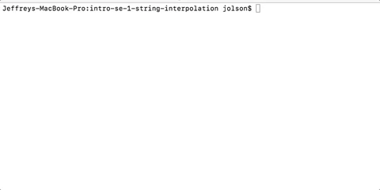

# Digital Business Cards

## The Goal

Let's create a program that prints out a beautiful command-line business card like this one:



## Skills you may need

The following three major skills are really useful, but you may be able to at least _start_ without them. If you want to jump right into the lab, code your business card maker in the file called cards.rb, and run it using the command `ruby cards.rb`.

### User Input

In the example above, you can see that the user is entering four pieces of information about him/herself into the console.

Making something like this work requires two lines of code: one to tell the user WHAT they're typing in, and another to get and store the input from the user.

Here's one example

```ruby
puts "What is your position?" #This line of code is so the USER knows what to enter.
job = gets.chomp # the left side means we will store the user's position in a variable called job.
```

`gets.chomp` is actually a pretty sophisticated chain of methods, but in plain English, the full expression basically means "whatever the user types in." So that line will store whatever the user enters as a string in a variable called job.

<details>
  <summary>Click here for more on `gets.chomp`</summary>

  `gets.chomp` is two methods chained together.

  The first method, `gets`, stands for "get string". The user will be typing, typing usually takes the form of words, so even if the user types a number like 17, Ruby will interpret that information as a string: "17".

  The second method, `chomp`, is a variation of another method called `chop`. That method, `chop`, simply chops off the last character, so "carrot".chop would return the string "carro" without that last letter, t.

  `chomp` is conditional version of `chop` - it only chops off the last character if it is a separator (a new line or something similar). Since the last thing the user hits is the "return" key in order to submit their information, the last character will always be a new line unless we chomp it off.

  Ruby actually has a lot of ways of handling extra separators built right in the puts method, so in many situations, `gets` would actually work exactly as well as `gets.chomp`, but most example code you will see will use the second method, as these two methods chained together are more reliable than using `gets` all by itself.

</details>

### Escape Sequences

You may want to store a string with some formatting in a variable. For example, consider these two ways of describing a dog:

###### Without escape sequences:
```ruby
# assign the variables:
description_line_1 = "Name: Maxine"
description_line_2 = "Breed: Puggle"
description_line_3 = "Color: Brown"
description_line_4 = "Weight: 12 lbs"

# print out the varibles:
puts description_line_1
puts description_line_2
puts description_line_3
puts description_line_4
```

###### With escape sequences:
```ruby
# assign all four lines to one variable:
full_description = "Name: Maxine \nBreed: Puggle \nColor: Brown \nWeight: 12 lbs"

# print out that variable:
puts full_description
```

Believe it or not, those two blocks of code do the exact same thing. The "\n" sequence is the way to say "new line" while inside of a string literal. It lets you insert a line break without actually pressing the return button.

You may want to use "\n" and "\t" in your code to insert new lines and to tab information in from the side; these escape sequences can help you format your business cards.

### Interpolation and Concatenation.

One last skill you may need is interpolation. You can tell from the example that we won't know the user's job until they type it in, but the program has to be finished before you can run it and get the user to type it in.

The way we delay this information is with a "fill in the blank" style of writing code. If you want to print out the sentence "Hello! My name is ______. Welcome!", but with the blank filled in with the contents of a variable called name, that code can be done either of two ways.

###### With interpolation:

```ruby
"Hello! my name is #{name}. Welcome!"
```

###### With concatenation:

```ruby
"Hello! my name is" + name + ". Welcome!"
```

While either of these two strategies can work really well, interpolation often leads to a more readable line of code, and makes it easier to catch formatting errors. Concatenation, on the other hand, has a lot of utility that will become more apparent the further we get into this course. Feel free to use whichever makes more sense to you.
